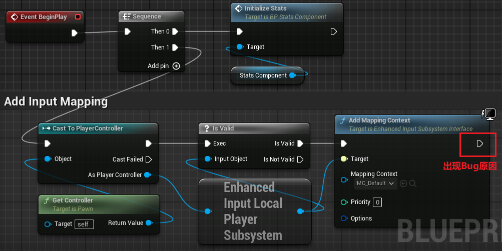
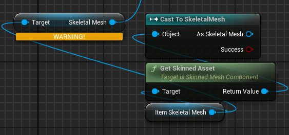
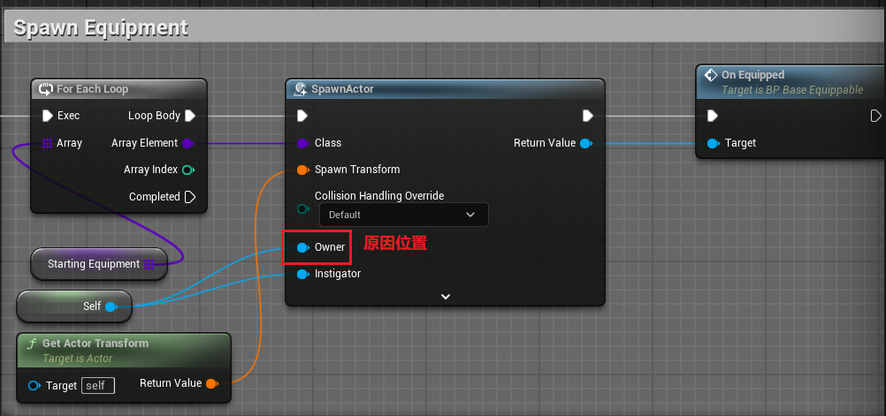

- [课程的 Udemy 网页链接](https://www.udemy.com/course/unreal-engine-5-soulslike-combat/)
- [虚幻五官方文档](https://docs.unrealengine.com/5.3/zh-CN/level-editor-in-unreal-engine/)


# Bug 合集

## 04 Advanced combat

### 008 Different Stat Costs for Different Weapons

> 问题描述：
> 
> 在将武器的不同攻击类型伤害接入 stat component 之后，使用武器轻攻击一次放置在场景中的 NPC，则 NPC 在受到伤害（不致命）后直接触发死亡

- 测试输出伤害正常（轻攻击伤害为 20，NPC 生命值为 100）
- 测试受到伤害后 stat component 中生命值更新情况，发现生命值直接更新为 0（**直接触发死亡的原因之一**）
- 输出 NPC 生命值，发现 NPC 生命值为 0。受到攻击才触发死亡的原因：**受到攻击后会对 NPC 生命值进行更新，判断角色是否死亡是放置在发生更新之后，从而产生角色受到攻击直接导致角色死亡的误判**

由于 NPC 生命值一直为 0，说明初始化 stat component 未正确运行，bug 位置如下（**直接触发死亡的原因之二**）



由于该角色为 NPC，之前一直将初始化连接在图中红框位置，**由于该角色不受玩家控制，所以前方进行`cast to player controller`时会失败，从而导致一直没有初始化**

后续修改位图中连接方式，NPC 将在正常的五次轻攻击（-20）后触发死亡。

### 009 Armor & Defense Stat

- Create armor
- Use Node SetLeaderComponent to let armor follow the character animation
- Set armor stat to reduce the damage taken

#### 问题一

> 描述
> 教程中使用了 `Set Master Pose Component`，经过搜索资料，在 5.2 及之后该节点被去除

在 UE 5.3 版本中搜索可以看到另一个，`Set Leader Pose Component`，[节点描述](https://docs.unrealengine.com/5.3/en-US/BlueprintAPI/Components/SkinnedMesh/SetLeaderPoseComponent/)：

> Set LeaderPoseComponent for this component
> 
> Target is Skinned Mesh Component

和节点 `Set Master Pose Component` 的[文档描述](https://docs.unrealengine.com/5.1/en-US/BlueprintAPI/Components/SkinnedMesh/SetMasterPoseComponent/)：

> Set MasterPoseComponent for this component
> 
> Target is Skinned Mesh Component

二者描述一致

#### 问题二

遇到了节点废弃问题



问题描述

```
Get SkeletalMesh : Usage of 'SkeletalMesh' has been deprecated. Use USkeletalMeshComponent::GetSkeletalMeshAsset() or GetSkinnedAsset() instead.
Get SkeletalMesh : Usage of 'Get Skeletal Mesh' has been deprecated. Use USkeletalMeshComponent::GetSkeletalMeshAsset() or GetSkinnedAsset() instead.
```

修改为图中节点

#### 问题三

> 描述
> 
> 在给测试用假人设置 armor 后运行报错

```
accessed none trying to read property K2Node Dynamic Cast As Character
```

原因：**忘记连接`owner`**



**发现的其他事情**：
- 注意这里连接了`instigator`，目的是后续 armor 的减伤，如果只是将 actor 生成在 owner 上，只需要连接 owner。
- 这里没有设置 socket，保持着默认的 none。可能是因为这套 armor 是 ue4 人物专用的原因，高度位置等已经对应设置好，所以生成后位置就在正确的位置。同时由于设置了 leader component，从而使得 armor 会随着人物发生同样的变换给人一种，穿在了对应 socket 位置的错觉

### 011 Dual Wield Weapons

#### 问题一：装备/卸下双手武器动画无法移动

原因：启用了根运动，导致动画插槽设置为上半身仍然无法移动。


