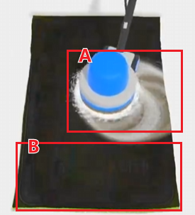
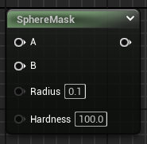
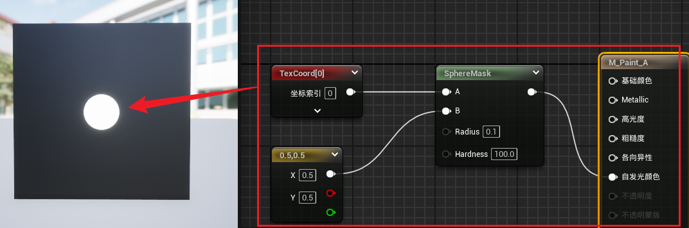
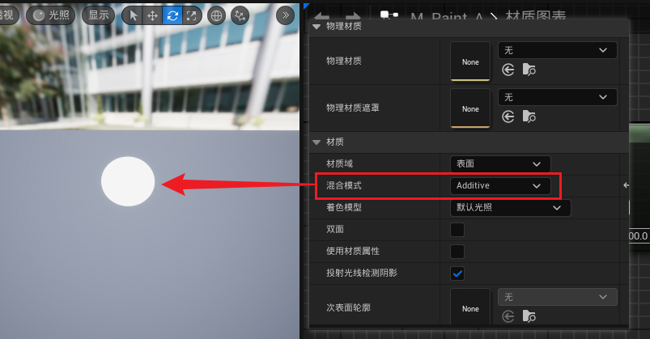
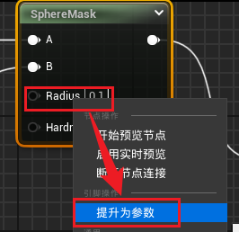
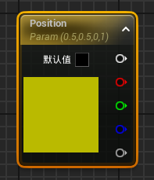
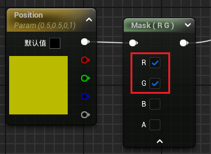
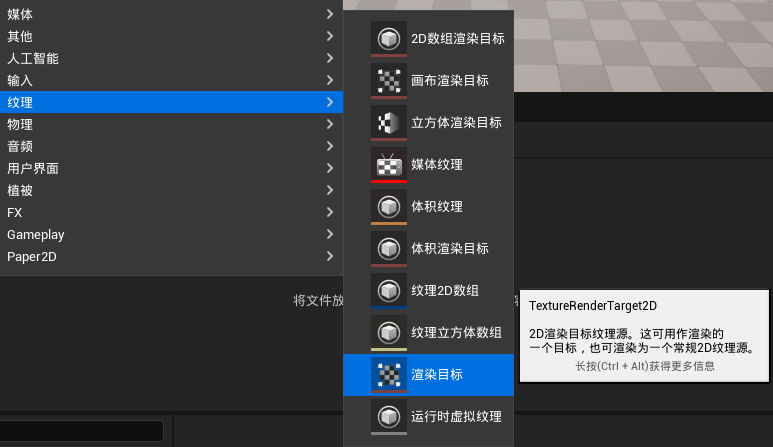

[教程地址](https://space.bilibili.com/148815144/channel/collectiondetail?sid=2641856&ctype=0)

效果示例：

大致思路：利用两层纹理，A 和 B，根据画笔经过位置将画布的纹理 B 修改位画笔引用的纹理 A
- A：画笔绘制的纹理
- B：画布的纹理

# 1.1 得到画笔

## 基本原理

画笔实现：

效果如图：

将**混合模式**设置为**Additive**去掉纹理的黑色部分：

## 画笔的属性

一个画笔的属性可以分为：
- 画笔位置（图中对应传入 B 节点的二维向量 Position）
- 尺寸大小（图中对应 Radius）
- 硬度（图中对应 Hardness）

在这里提升为参数需要“右键点击->提升为参数”：

## 四维和二维，以及 ComponentMask

当位置信息被提升为变量之后，输出信息变为四维

而 **SphereMask** 需要的位置信息为二维，这里需要使用到 **ComponentMask**

- 渲染目标
- 虚拟纹理

# 绘制到渲染目标 TextureRendererTarget

为了接收画笔的绘制效果，需要有一个画布进行储存，这里使用**渲染目标**

另外新建一个蓝图 Actor 类，用来实现画笔绘制到画布的逻辑

