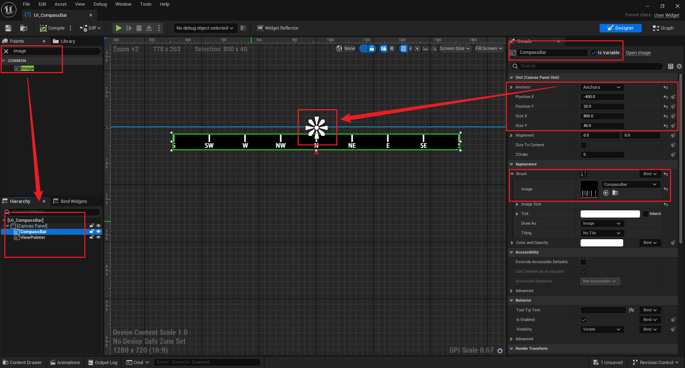
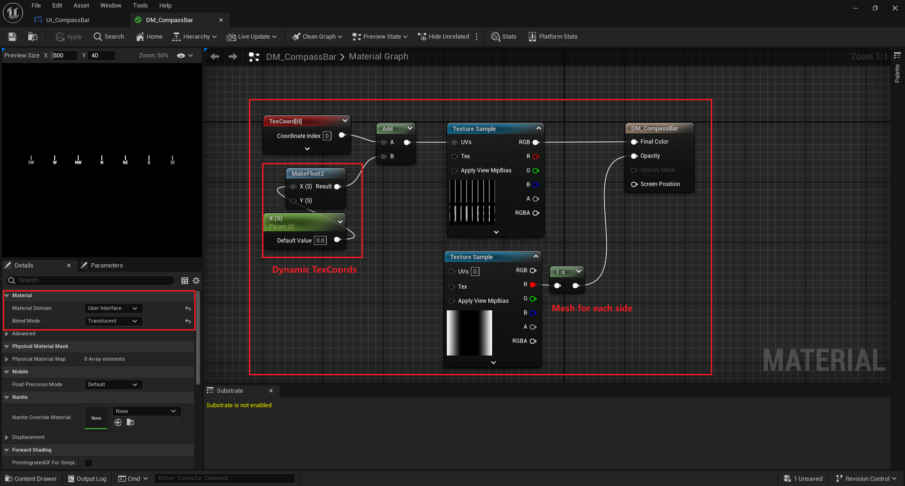
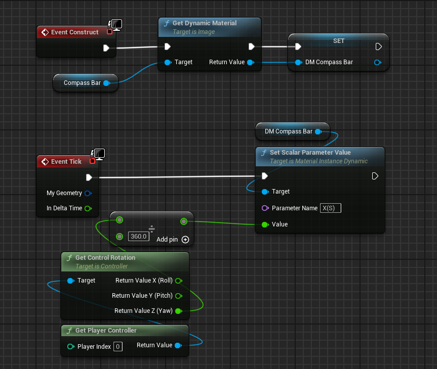
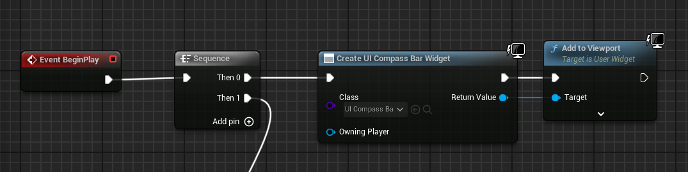
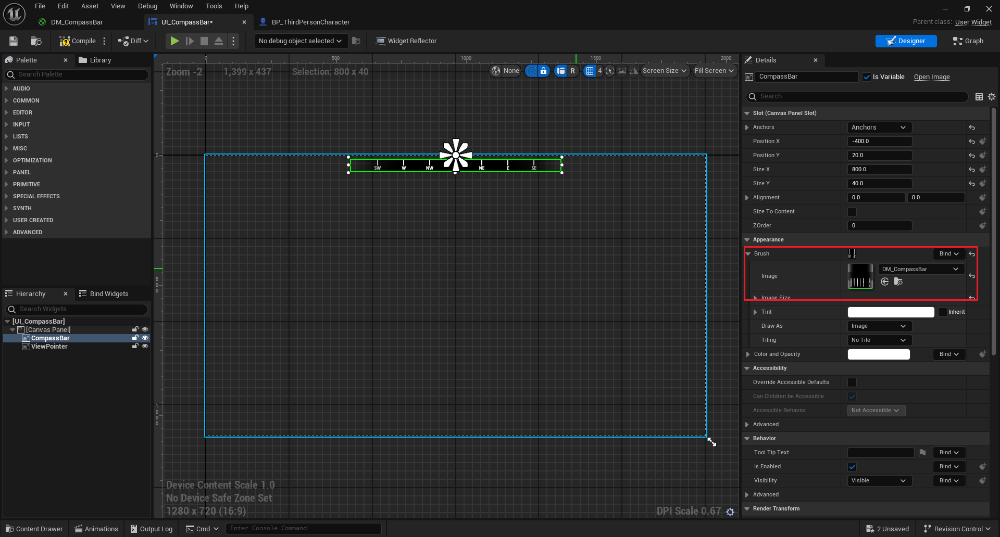
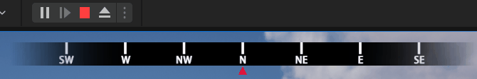

# Compass Bar

[UE5 怎样制作条状指南针](https://www.bilibili.com/video/BV1Ry421a75b/?spm_id_from=333.999.0.0&vd_source=ec161869fed250aa616ee2fdd48e6494)

## PS 制作指南针纹理

Compass Bar: 

Mesh: 

View Pointer: 

## UE 5 创建 UI 控件

调整条状指南针在屏幕上的布局

## UE 5 创建动态材质

随着视角转动，指南针的纹理应当同样发生变化

## UE 5 接收视角转动

向动态材质传递视角转动数据

## UE 5 视角内创建条状指南针

角色蓝图内，创建 Widget 并添加到视口中

## UE 5 Widget 中使用动态材质

最后需要将 UI Widget 中设置为创建好的动态材质

##  最后效果

# 总结

- UI Widget：类似于 OpenGL 中，使用铺屏四边形
- 纹理映射：将指南针纹理映射到正上方中心位置
- 动态材质：随着角色的 view direction 变化，而修改纹理在某个轴上的映射关系
- 着色器：利用 Mesh 来制作两端渐变透明的效果
