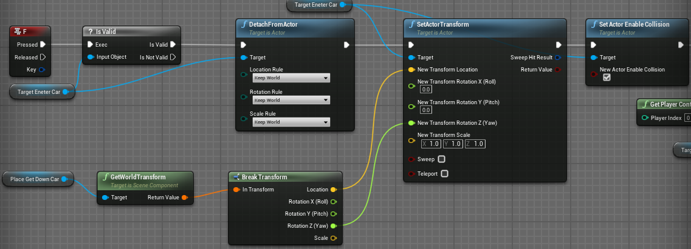

#gamedev  #ue4 
- [【蓝图】10课：角色上下车功能](https://www.bilibili.com/video/BV164411Y732?t=139.4&p=44)
---

汽车蓝图要实现：
- 上车
- 下车
- 下车减速

# 实现：上车

## 角色中实现：按F触发上车事件

- 检测键盘输入节点
- 建立车的引用，并检测是否有效
  - 是，则触发上车事件

## **第一步**：实现从角色到汽车的控制权切换

- 检测 overlap
  - 利用类型转换获取触发 overlap 的 actor
    - 通过类型转换还能检测是否为目标actor
    - 例如这里只有是第三人称角色才能触发
  - 将车对象传递给角色中的车引用
- 触发上车事件

**需要注意**：这里在传入角色引用，即自定义事件 CarGetIn 的`Target Enter Car`时，选择的类型为 `pawn`
- 这里与下车部分的`Set View Target with Blend`有关

至此上车事件前置条件已经完成，随后需要切换玩家控制权

## **第二步**：让角色跟着汽车移动

切换控制权至汽车后还需要设置角色随着汽车移动

- 另外建立一个 collision sphere 用以获取角色上车后的位置
  - GetWorldTransform
- 设置 Actor
  - SetActorTransform
- 传递 location 和 rotation（只传递 z 轴，因为只需要左右转动，不需要其他角度）
- 注意关闭 actor 的碰撞：SetActorEnableCollision

至此在按下F后角色会被放在之前设置的 collision sphere 的位置，但并不会随着汽车移动，还需要将角色 attach to 这个 sphere

- 即将 Actor 附加到 sphere 上：AttachActorTransform
  - 选择 Keep World，指定角色保持与 sphere 的世界坐标一致

**目前效果**：

---
# 实现：下车

下车的实现与上车实现逻辑相反

- 同样按下F触发，此时要判断角色是否在车上
  - 这里的判断方式就是检测汽车蓝图中的`Target Enter Car`变量`is Valid?`
  - 这个变量是在角色上车并切换控制权后才设置的
- 按照上车的实现逻辑，这里反过来
  - 首先 Detach from Actor，并将下车位置传递给角色
    - 这里另设置一个 collision sphere 来标识角色下车位置
  - 记得在设置完下车位置后再开启碰撞

至此角色已经实现下车，但还需要将控制权切换回角色，这里增加了一个镜头的过渡动画
- 这里的`Set View Target with Blend`需要传入的`New View Target`需要传入的类型为`pawn`，故之前需要设置角色的引用为该类型

**实现效果**：

---
# 实现：下车减速

